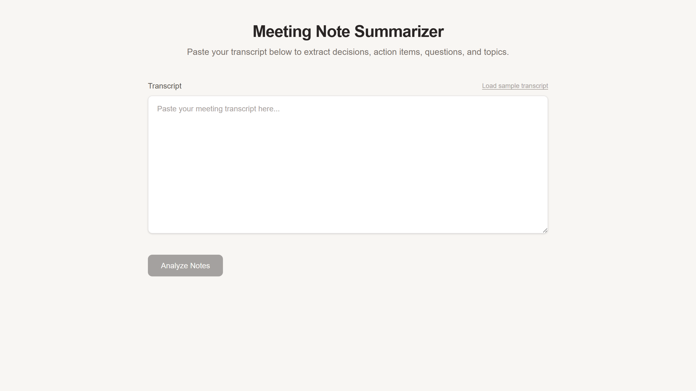

# Meeting Note Summarizer

[](https://github.com/kamarajendra/meeting-note-summarizer/actions/workflows/ci.yml)
[](https://github.com/kamarajendra/meeting-note-summarizer/releases)
[](https://github.com/kamarajendra/meeting-note-summarizer/blob/main/LICENSE)

A Next.js application that extracts decisions, action items, open questions, and key topics from meeting transcripts using rule-based parsing. No AI, no API keys.

## Screenshot



## Features

- Paste raw meeting transcripts
- Extracts decisions, action items, open questions, and key topics
- Rule-based parsing with keyword detection
- Structured output for easy review

## Tech Stack

- Next.js 16 App Router
- React 19
- TypeScript
- Tailwind CSS 4
- Vitest

## Getting Started

```bash
npm install
npm run dev
```

## License

MIT
